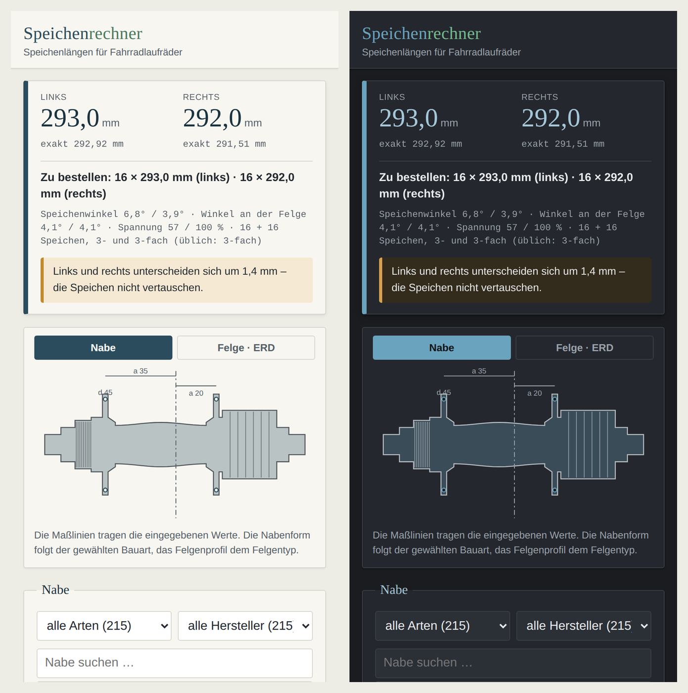

# Speichenrechner

## ⬇️ Aufs Handy — die App herunterladen

**➡️ [speichenrechner.apk herunterladen](https://github.com/kaysiebke-cell/speichenrechner/releases/latest/download/speichenrechner.apk)**

Der Link führt immer auf den Stand von `main`: jeder Push, der die App
betrifft, baut die APK und hängt sie ans rollende Release „neueste". Ein Tag
ist dafür nicht nötig.

Antippen, installieren, fertig — danach liegt der Speichenrechner als App im
Menü. 3,3 MB, läuft ohne Netz, **verlangt kein Internet, keine Dateien, keinen
Standort**. Android fragt beim ersten Mal nach „Aus dieser Quelle installieren“,
weil die APK mit dem Debug-Schlüssel signiert und nicht über den Play Store
verteilt ist.

Drin ist alles: Rechnung, 230 Naben, 17 Felgentypen.
Anleitung samt Stolpersteinen: **[APK-HERUNTERLADEN.md](APK-HERUNTERLADEN.md)**

**PC:**

```bash
python3 speichenrechner.py
```

Speichenlängen für Fahrradlaufräder berechnen. Zwei Fassungen, ein Repo,
**getrennte Ordner**:

```
pc/        PC-Anwendung (GTK für Linux Mint)
app/       Handy-Fassung – public/ als Web-App, android/ als APK-Hülle
data/      gemeinsame Daten: Nabenkatalog, Felgentypen, Prüfwerte
werkzeuge/ erzeugen und prüfen die Daten für beide Fassungen
tests/     prüfen beide Fassungen
```

Die Daten liegen **einmal** in `data/` und versorgen beide Seiten – doppelt
gepflegte Kataloge wären der Anfang vom Auseinanderdriften.

* **PC** – eine GTK-3-Anwendung in Python für Linux Mint (Cinnamon), in
  `pc/speichenrechner/`. Sie bringt bewusst kein eigenes Farbschema mit: Schrift,
  Farben, Icons und die Hell/Dunkel-Variante kommen aus den
  System-Einstellungen, sie passt sich also dem eingestellten Mint-Theme an.
* **Handy** – eine Web-Fassung in `app/public/`, die ohne Netz läuft und sich auf
  dem Startbildschirm ablegen lässt, plus eine Android-App darum herum.

## Was die App darf

**Nichts, was sie nicht braucht.** Geprüft an der gebauten APK:

```
Paket            de.speichenrechner.app  1.8.3
Berechtigungen   kein INTERNET, kein Speicher, kein Standort, keine Kamera
enthalten        assets/www/ – index.html, css, 6 Skripte, Icons
```

Gerechnet wird auf dem Gerät. Die einzige Berechtigung im Paket heißt
`DYNAMIC_RECEIVER_NOT_EXPORTED_PERMISSION` und kommt von der
AndroidX-Bibliothek; sie wird nicht abgefragt und gilt nur innerhalb der App.

## Zum Ausprobieren am Rechner

Wer die Handy-Fassung während der Arbeit am PC ansehen will, braucht keine APK:

```bash
python3 -m http.server 8765 --directory app/public --bind 0.0.0.0
```

Dann `http://<PC-IP>:8765/` am Handy öffnen. Dieselben Dateien liegen unter
<https://kaysiebke-cell.github.io/speichenrechner/> und stecken in der APK –
`app/public/` ist die eine Quelle für alle drei.



So sieht die Handy-Fassung aus: ein Blatt je Bildschirm, gewechselt über die
Reiterleiste unten, das Ergebnis fest darüber. Gestaltet wie die Schreibhilfe
seit deren Umbau – systemnah statt Aktenlage: kühle Flächen, durchgehend
Systemschrift, gebrochene Ecken, und Höhe statt Rahmen. Ob hell oder dunkel,
entscheidet das Gerät.

Am PC sieht es anders aus, und das mit Absicht – dort folgt die Anwendung dem
eingestellten Mint-Theme:


## Installation

Voraussetzung ist PyGObject mit GTK 3 – auf Linux Mint ist beides normalerweise
schon vorhanden. Falls nicht:

```bash
sudo apt install python3-gi gir1.2-gtk-3.0
```

Menüeintrag und Schreibtisch-Icon anlegen (ohne `sudo`, nur für den aktuellen
Benutzer):

```bash
pc/install.sh
```

Danach liegt der Speichenrechner im Menü unter *Zubehör*, zusätzlich als
anklickbares Icon auf dem Schreibtisch. Wieder entfernen:

```bash
pc/install.sh --entfernen
```

Direkt starten geht auch ohne Installation – aus der Wurzel oder direkt:

```bash
python3 speichenrechner.py
```

Das Skript in der Wurzel reicht nur an `pc/speichenrechner.py` durch. So
funktioniert der gewohnte Aufruf weiter, obwohl die Anwendung seit der Trennung
in `pc/` liegt – und alte Verknüpfungen brechen nicht.

### Wenn nichts passiert

Erst den Selbsttest laufen lassen – er startet keine Oberfläche, sondern meldet,
was fehlt:

```bash
python3 pc/speichenrechner.py --pruefen
```

Der Speichenrechner ist eine **Einzelinstanz-Anwendung**: Läuft schon ein
Fenster – auch minimiert oder auf einer anderen Arbeitsfläche –, holt ein
zweiter Start nur dieses nach vorn, es öffnet sich kein neues. Nachsehen mit:

```bash
pgrep -af speichenrechner.py
```

Für eine Fehlermeldung im Klartext hilft der Start aus dem Terminal:

```bash
python3 /home/kaysiebke/Downloads/Speichenrechner/pc/speichenrechner.py
```

### Wo das Icon liegt

`pc/install.sh` legt drei Dinge an:

| Was | Wo |
|---|---|
| Verknüpfung auf dem Schreibtisch | `~/Desktop/de.speichenrechner.Speichenrechner.desktop` |
| Eintrag im Menü unter *Zubehör* | `~/.local/share/applications/de.speichenrechner.Speichenrechner.desktop` |
| Icon-Grafik | `~/.local/share/icons/hicolor/scalable/apps/de.speichenrechner.Speichenrechner.svg` |

Erscheint die Verknüpfung nicht auf dem Schreibtisch, muss Cinnamon den
Schreibtisch neu zeichnen – ab- und wieder anmelden genügt, oder:

```bash
nemo-desktop --quit && (nemo-desktop &)
```

## Bedienung

1. **Nabe** – Flanschdurchmesser und Flanschabstand je Seite eintragen. Der
   Flanschabstand wird von der Nabenmitte bis zur Flanschmitte gemessen. Über
   *Flanschabstand aus Einbaubreite …* lassen sich stattdessen die leichter
   messbaren Maße ab Kontermutter eingeben – und Werte aus fremden
   Nabendatenbanken, siehe [Werte aus fremden Datenbanken](#werte-aus-fremden-datenbanken).
2. **Felge** – ERD eintragen (effektiver Felgendurchmesser von Nippelsitz zu
   Nippelsitz, **nicht** der Reifensitz). Bei asymmetrischen Felgen zusätzlich
   den Versatz: minus = Speichenbett nach links, plus = nach rechts. Darunter
   steht der **Felgentyp** – siehe [Felgentypen](#felgentypen).
3. **Einspeichung** – Speichenzahl, Verteilung und Kreuzungen. 0 Kreuzungen
   bedeutet radial. Bei „2:1“ trägt die rechte Seite doppelt so viele Speichen.
4. **Speichen** – Bauart, Zielspannung, Kopflage und Straightpull. Über den
   Stift-Knopf lassen sich Abschnittsmaße und E-Modul frei einstellen.
5. **Nippel und Korrektur** – Unterlegscheiben, **Nippellänge** und Weitung.
   Bei der Nippellänge wählt man, was auf der Packung steht – 12 mm (üblich),
   14 mm oder 16 mm; der Abzug darunter ergibt sich daraus (12 → 0,0 mm,
   14 → 2,0 mm, 16 → 4,0 mm) und ist gesperrt. Wer eine Herstellerangabe hat,
   wählt „eigener Abzug“ und tippt sie ein. Der Haken zieht die Summe aus
   Dehnung, Weitung und diesem Abzug von der Bestelllänge ab – **ohne den Haken
   wirkt der Abzug nicht.**

Das Ergebnis erscheint sofort: gerundete Länge je Seite, der exakte Wert, der
Speichenwinkel, was zu bestellen ist, das Spannungsverhältnis, Dehnung, Gewicht
und Speichenton. Plausibilitätsprobleme (unmögliche Kreuzungszahl, ungewöhnlicher
ERD, große Seitendifferenz) werden als Hinweis eingeblendet, dazu kommt eine
fachliche Einschätzung zu Speichenwinkel und Spannungsverhältnis.

Wer nicht weiß, was genau zu messen ist, öffnet den Reiter **Messen /
Vergleich**: dort stehen die eingegebenen Maße als Klartext beieinander –
Flanschabstand und Flansch-Ø je Seite, ERD und Versatz. Die Buchstaben, die in
der Fachliteratur dafür stehen: `a` der Flanschabstand ab Nabenmitte, `d` der
Flansch-Lochkreis, `D` der ERD.

Über die Kopfleiste lässt sich das Ergebnis in die Zwischenablage kopieren oder
als Textdatei sichern. Häufig gebrauchte Naben und Felgen lassen sich als eigene Vorlage
speichern; die zuletzt eingegebenen Werte stehen beim nächsten Start wieder da.

### Aufteilung des Fensters

Ganz oben stehen die beiden Längen, ganz unten die Hinweise – beides bleibt
immer sichtbar. Dazwischen liegt die Arbeit in vier Reitern:

| Reiter | Was er zeigt |
|---|---|
| **Laufrad** | Nabe, Felge und Einspeichung – alles, was die Länge bestimmt |
| **Speichen / Spannung** | Speichenbauart, Nippel und Korrektur, dazu Spannungsverhältnis, Dehnung, Speichenton und Gewicht |
| **Messen / Vergleich** | die eingegebenen Maße als Klartext, darunter die Tabelle über 0- bis 4-fach gekreuzt |
| **Bewertung** | fachliche Einschätzung zu Winkel, Spannung und Kreuzungszahl |

### Nabenkatalog

Die Auswahlliste im Abschnitt **Nabe** enthält neben den Vorlagen den ganzen
Nabenkatalog – kein zweites Fenster, kein Menü. Von den 230 Naben sind 215
einspeichbar; die übrigen 15 sind Tretlager-Getriebe, siehe unten. Sie kommen
von 17 Herstellern: Classified, Enviolo, Fichtel & Sachs, Formula, Hope,
Joytech, Kindernay, KT, Phil Wood, Quando, Rohloff, Shimano, Shutter
Precision, SON, SRAM, Sturmey-Archer und Supernova.

**Je Modellreihe steht ein Eintrag**, sonst wird die Liste zur Wand: aus 215
Naben werden so 182 Zeilen. Hinter 24 davon steckt mehr als eine Ausführung –
die Hope Pro 4 etwa fünf, die sich nur in der Achse unterscheiden. Dann
erscheint nach der Wahl darunter die Zeile *Ausführung*; bei den übrigen 158
Reihen merkt man von der Zusammenfassung nichts.

Die Zeile nennt **nur den Namen**, dazu ein Häkchen, wenn sich die Nabe ohne
Nachmessen rechnen lässt. Einbaubreite, Lochzahl, Achstyp, Bremsaufnahme und
Freilauftyp standen einmal mit darin – bei zweihundert Zeilen untereinander
findet man den Namen dann nicht mehr. Sie stehen jetzt als Hinweis unter der
Liste, sobald eine Nabe gewählt ist.

Darüber stehen zwei Filter – **Nabenart** und **Hersteller** –, die die Liste
kurz halten. Sie gelten für **alles** in der Liste, auch für die mitgelieferten
Vorlagen: bei „Kassette“ verschwinden Dynamos und Getriebenaben, bei einem
gewählten Hersteller bleiben nur dessen Modelle. Die Herstellerliste passt sich der gewählten Art an: bei „Dynamo“
stehen dort nur die sechs Hersteller, die auch Dynamos führen. Passt die
bisherige Herstellerwahl nicht mehr zur neuen Art, springt sie auf „alle
Hersteller“ zurück.

**Bauart und Ritzelaufnahme sind zwei verschiedene Dinge** und stehen
nebeneinander in derselben Liste. Eine Nabe taucht unter jedem ihrer Merkmale
auf: eine Rohloff unter *Nabenschaltung* wie unter *Schraubritzel*, ein
SON-Dynamo unter *Dynamo* wie unter *Vorderrad*.

| Merkmal | Naben | Hersteller |
|---|---|---|
| Vorderrad | 90 | Hope, SON, Shimano, Shutter Precision, SRAM, Sturmey-Archer, Supernova |
| Nabenschaltung | 73 | Classified, Enviolo, Fichtel & Sachs, Kindernay, Rohloff, Shimano, SRAM, Sturmey-Archer |
| Dynamo | 69 | SON, Shimano, Shutter Precision, SRAM, Sturmey-Archer, Supernova |
| Hinterrad | 52 | Formula, Hope, Joytech, KT, Phil Wood, Quando, Shimano |
| Kassette | 35 | Classified, Hope, Kindernay, Shimano, SRAM |
| Schraubritzel | 26 | Rohloff |
| Schraubkranz | 17 | Formula, Hope, Joytech, KT, Phil Wood, Quando, Sturmey-Archer |
| Steckritzel | 17 | Shimano, Sturmey-Archer |
| Steckzahnkranz | 9 | Enviolo |
| Singlespeed | 5 | Hope |

Die Bauart kommt aus dem Tabellenblatt, die Ritzelaufnahme aus der Spalte
*Kassetten-/Freilaufkörper-Typ*.

**Tretlager-Getriebe stehen nicht in der Nabenauswahl.** Die Tabelle trennt sie
im Blatt *Nabenschaltung* mit der Zeile „folgende Systeme sind KEINE
einspeichbaren Laufradnaben, sondern Tretlager-Getriebe“ ab; die 15 Pinion- und
Effigear-Systeme dahinter haben kein Speichenloch. Im Katalog bleiben sie
erhalten und sind im Fenster *Nabentabelle* zu sehen – nur eben nicht dort, wo
man eine Nabe zum Einspeichen wählt.

> Was die Tabelle nicht führt, kann kein Filter zeigen. Über *Menü →
> Nabentabelle bearbeiten … → Nabe hinzufügen* lässt sich Fehlendes ergänzen,
> ohne die Excel-Datei anzufassen – die acht OEM-Schraubkranznaben von
> Joytech, Quando, Formula und KT stehen genau deshalb in
> `data/naben_zusatz.json`.

Der Freilauftyp steht im Hinweis unter der Liste, gekürzt auf die Standards –
aus „Shimano HG (9–11-fach), Shimano Micro Spline (12-fach) und SRAM XD“ wird
`HG · Micro Spline · XD`. Gesucht wird trotzdem über den vollen Text,
`micro spline` findet also alle passenden Naben.

Die Liste ist **eintippbar**: „son disc“ oder „boost“ filtert sofort, egal an
welcher Stelle im Namen der Begriff steht.

**73 Naben sind rechenfertig** – sie führen auch Flanschabstand und Flansch-Ø
und stehen deshalb oben in der Liste, am Häkchen erkennbar. Sie verteilen sich
auf 54 Modellreihen; innerhalb einer Reihe steht ebenfalls vorn, was sich
rechnen lässt. Ein Klick genügt, die Länge steht sofort da.

Bei den übrigen setzt der Rechner Speichenloch-Ø und Lochzahl, merkt sich die
Einbaubreite für die Umrechnung „Flanschabstand aus Einbaubreite …“ und trägt
den Modellnamen in den Ergebnisbericht ein; Flanschabstand und Flansch-Ø
bleiben dort nachzutragen.

> Auch die Katalogwerte vor dem Bestellen gegenprüfen. Hersteller ändern Maße
> zwischen Baujahren, und ein Tippfehler in der Tabelle fällt beim Rechnen
> nicht auf.

### Nabentabelle nachtragen

Fehlt bei einer Nabe etwas, lässt es sich in der Anwendung nachtragen:
**Menü → Nabentabelle bearbeiten …**. Das Fenster zeigt den Katalog mit
denselben Spalten wie die Excel-Tabelle; jede Zelle ist anklickbar und
änderbar. Der Haken *nur ohne Flanschmaße* zeigt genau die Naben, bei denen
zum Rechnen noch etwas fehlt.

Über *Nabe hinzufügen …* lassen sich auch Naben anlegen, die in der Tabelle
ganz fehlen – Hersteller, Modell und Bauart angeben, den Rest in der Tabelle
nachtragen.

Gespeichert wird **nicht** in die Excel-Datei, sondern als Nachtrag in
`~/.config/speichenrechner/naben_ergaenzungen.json`. Damit bleibt die Tabelle
die Quelle: Erweiterst du sie und erzeugst den Katalog neu, gehen die in der
Anwendung eingetragenen Werte nicht verloren. *Als CSV sichern …* legt den
Stand als Semikolon-CSV ab, um ihn in die Tabelle zurückzuholen;
*Nachträge verwerfen* stellt den Stand der Tabelle wieder her.

Die Schreibweisen sind dieselben wie in der Tabelle – Editor und Konverter
benutzen dieselbe Auswertung aus `speichenrechner/tabelle.py`, sie können also
nicht auseinanderlaufen.

Der Katalog wird aus `daten_quelle_naben.xlsx` erzeugt:

```bash
python3 werkzeuge/katalog_erzeugen.py daten_quelle_naben.xlsx
```

Danach prüfen, ob alles richtig ankam:

```bash
python3 werkzeuge/katalog_pruefen.py daten_quelle_naben.xlsx
```

Die Prüfung vergleicht jede Zelle der Tabelle mit dem Katalog und meldet
fehlende Zeilen, nicht auswertbare Angaben und widersprüchliche Einordnungen –
etwa eine Vorderradnabe mit Ritzelaufnahme. Rückgabewert 1, wenn etwas
gefunden wurde.

Ein Blatt je Nabenart (Nabendynamo, Nabenschaltung, Vorderradnabe,
Hinterradnabe) mit den Spalten *Hersteller, Modell, Lochzahl, Einbaubreite /
OLD, Achstyp, Bremsaufnahme, Speichenloch-Ø, Flanschabstand, Flansch-Ø /
Lochkreis, Kassetten-/Freilaufkörper-Typ*.

Die Spalten werden **über ihre Überschriften** zugeordnet, nicht über feste
Positionen – eine umsortierte oder erweiterte Tabelle bricht damit nicht.
Blätter wie *Nabe mit Kassette* sind Querlisten: die dort erneut aufgeführten
Naben werden zusammengeführt, nicht doppelt aufgenommen, und das Blatt gilt
als Hinweis auf die Ritzelaufnahme, falls die Freilaufspalte schweigt. Die beiden Flanschspalten versteht der Konverter in
mehreren Schreibweisen:

| Eintrag | wird gelesen als |
|---|---|
| `47,5 (22,5/25)` | links 22,5 mm, rechts 25 mm – die Klammer gewinnt |
| `33/20` | links 33 mm, rechts 20 mm |
| `58 (symmetrisch)` | Gesamtabstand → 29 mm je Seite |
| `Ø100` | 100 mm links wie rechts |
| `59/54` | links 59 mm, rechts 54 mm |
| `k. A.`, `entfällt` | unbekannt, bleibt leer |
| `42/42 (18-24L) bzw. 38/38 (32/36L)` | mehrdeutig – wird **nicht** übernommen |

Beim Flanschabstand gilt eine einzelne Zahl als Maß über **beide** Flansche
und wird halbiert; beim Durchmesser gilt sie für beide Seiten.

### Felgentypen

Im Abschnitt **Felge** steht unter ERD und Versatz der **Felgentyp** – 17
Bauformen aus `daten_quelle_felgen.xlsx`, aufgeteilt in *Bauform*, *Material*
und *Einsatzbereich*. Die Klappliste darüber schränkt auf eine Kategorie ein,
wie beim Nabenkatalog.

Der Typ ändert die Speichenlänge **nicht**. Er ändert zwei andere Dinge:

* Unter der Auswahl steht, was die Tabelle über ihn sagt – Beschreibung,
  Werkstoff, Ösung, Einsatzbereich, verfügbare Kindergrößen.
* Der Rechner sagt etwas dazu: eine einwandige Felge ohne Ösen bekommt den
  Hinweis auf Unterlegscheiben, Carbon den Verweis auf die Herstellerangabe,
  Stahl die Warnung vor zu hoher Spannung.

Für die Spannung gilt als Anhaltswert:

| Werkstoff | übliche Speichenspannung |
|---|---|
| Stahl | 500–800 N |
| Aluminium | 800–1100 N |
| Carbon | 900–1200 N |
| Titan | keine Faustregel – Einzelstücke |

Nennt ein Typ zwei Werkstoffe („Aluminium/Stahl“), begrenzt der schwächere.
Liegt die eingestellte Zielspannung außerhalb, erscheint das als Warnung.

> Diese Spannen sind Anhaltswerte für den Fall, dass nichts anderes bekannt
> ist. **Die Angabe des Felgenherstellers geht immer vor.**

Erzeugt wird die Liste wie der Nabenkatalog aus der Tabelle:

```bash
python3 werkzeuge/felgen_erzeugen.py daten_quelle_felgen.xlsx
```

Die Hinweiszeile am Ende der Tabelle ist kein Felgentyp; sie wird als Fußnote
übernommen und steht in der Anwendung unter der Auswahl. Ob alles richtig
ankam, prüft `tests/test_felgenkunde.py`: der Test liest die Tabelle noch
einmal ein und vergleicht sie Zelle für Zelle mit dem erzeugten Katalog.

### Vorlagen

Es gibt zwei Sorten mitgelieferter Nabenvorlagen, am Namen erkennbar:

* **(typisch)** – Anhaltswerte für die Bauart, keine Herstellerangaben. Nur als
  Startpunkt gedacht.
* Namentlich genannte Naben – aus den Herstellerangaben übernommen (Stand
  August 2026):

  | Vorlage | Flanschdurchmesser l/r | Flanschabstand l/r | Speichenloch |
  |---|---|---|---|
  | Rohloff SPEEDHUB 500/14 (135/142 mm) | 100 / 100 mm | 29 / 29 mm | 2,7 mm |
  | Rohloff SPEEDHUB 500/14 A12 (148 mm, asym.) | 100 / 100 mm | 32 / 26 mm | 2,7 mm |
  | SON 28 Nabendynamo (Felgenbremse, 100 mm) | 69 / 69 mm | 31 / 31 mm | 2,0 mm |
  | SON 28 Disc 6-Loch Nabendynamo | 59 / 54 mm | 22,5 / 25 mm | 2,0 mm |
  | SONdelux Nabendynamo (Felgenbremse) | 54 / 54 mm | 25 / 25 mm | 2,0 mm |
  | White Industries ENO (Schraubkranz, 135 mm) | 60 / 60 mm | 32 / 32 mm | – |
  | White Industries ENO Flip Flop (Schraubkranz) | 48 / 48 mm | 32,5 / 32,5 mm | 2,6 mm |

  Rohloff gibt Speichenlochkreis Ø 100 mm, Flanschabstand 58 mm symmetrisch
  (A12-148: 3 mm zur Scheibenbremsseite versetzt) und Speichenloch Ø 2,7 mm an;
  die SON-Werte stammen aus den Datenblättern der jeweiligen Nabe. Die beiden
  White-Industries-Naben haben ein Schraubkranzgewinde 1,375″ × 24 TPI und sind
  symmetrisch – sie tragen kein Ritzelpaket, das rechts Platz braucht. Wo der
  Hersteller den Speichenloch-Ø nicht angibt, steht „–“ und die Vorgabe 2,6 mm
  greift.

> Auch die Herstellerwerte vor dem Bestellen gegenprüfen – Maße ändern sich
> zwischen Baujahren, und der ERD der Felge muss ohnehin nachgemessen werden.

Vorlagen tragen wie Katalognaben **Bauart und Ritzelaufnahme** und stehen im
Filter unter beidem: die Rohloff-Vorlage unter *Nabenschaltung* wie unter
*Schraubritzel*. Vorher galt das nur für den Katalog, obwohl der Filter-Tooltip
es für beides versprach.

### Nachgetragene Naben

`data/naben_zusatz.json` enthält Naben, die **nicht** aus der Herstellertabelle
stammen. Eine eigene Datei, damit die Tabelle die Tabelle bleibt:
`katalog_erzeugen.py` überschreibt nur `naben_katalog.json`, `naben_zusatz.json`
bleibt liegen. Steht ein Modell in beidem, gewinnt die Tabelle.

Jede Zeile nennt ihre Herkunft, und die ist in der Auswahlliste zu sehen:

| in der Liste | Bedeutung |
|---|---|
| **nachgetragen** | Maße aus einer benannten Quelle – Herstellerseite oder Nabendatenbank |
| **ungeprüft** | Modellbezeichnung ohne belegte Maße; Flanschmaße fehlen und müssen nachgemessen werden |

Aktuell drin: eine Shimano RX100 FH-A550 (rechenfertig, Maße umgerechnet aus
einer Nabendatenbank), drei Phil-Wood-Naben mit Gewinde 1,370 × 24 tpi (je ein
Maß fehlt) und acht OEM-Schraubkranznaben von Joytech, Quando, Formula und KT
(nur Modell, Einbaubreite und Lochzahl). Prüfregeln dazu stehen in
`tests/test_katalog.py`: was „ungeprüft“ heißt, darf keine Flanschmaße tragen,
und halbe Angaben dürfen nicht als rechenfertig gelten.

Die Prüfung `katalog_pruefen.py` lässt diese Naben außen vor – sie fehlen in der
Tabelle mit Absicht.

### Werte aus fremden Datenbanken

Es gibt Nabendatenbanken mit Flanschmaßen – spokelengthcalculator.com führt
über 900 Naben. **Deren „flange offset“ ist aber ab Kontermutter gemessen, nicht
ab der Nabenmitte.** Die Seite definiert es selbst als „the distance from the
lock nut to the centre of the flange“ und rechnet `flange offset = OLD/2 − Wl`.

Solche Werte gehören in den Dialog *Flanschabstand aus Einbaubreite …*, nicht
direkt in das Feld Flanschabstand. Sonst rechnet die App still falsch:

| Nabe | dort angegeben | ab Nabenmitte |
|---|---|---|
| Hope Pro 4 Vorderrad, 100 mm | 30 / 16,99 | 20 / 33,0 |
| Hope Pro 4 Hinterrad, 135 mm | 34,5 / 48,5 | 33,0 / 19,0 |
| Shimano RX100 FH-A550, 126 mm | 25,7 / 42,3 | 37,3 / 20,7 |

Die Probe, an der die Verwechslung auffällt: ab Nabenmitte gelesen ergäbe die
Hope Pro 4 einen Flanschabstand von 83 mm in einer 135-mm-Nabe, mit der
Antriebsseite weiter außen als die Bremsseite. Beim Hinterrad muss die
Antriebsseite immer **innen** liegen. Die drei Beispiele stehen als Tests in
`tests/test_berechnung.py`.

## Handy-Version

In `app/public/` liegt eine Web-Fassung: eine Seite, ein Stylesheet, sechs
JavaScript-Dateien. **Kein Bauschritt, keine Abhängigkeiten, nichts von einem
fremden Server** – dieselbe Regel wie bei der PC-Anwendung. Ein Service Worker
legt die ganze Anwendung in den Cache, damit sie ohne Empfang rechnet; in der
Werkstatt ist das der Normalfall.

Zum Ansehen genügt ein Ordner-Server:

```bash
python3 -m http.server 8765 --directory app/public
```

Zwei Wege aufs Handy, beide in **[APK-HERUNTERLADEN.md](APK-HERUNTERLADEN.md)**
beschrieben: über den Browser mit „Zum Startbildschirm hinzufügen", oder als
APK, die GitHub bei jedem Push baut (`.github/workflows/android.yml`). Die APK
verlangt keine einzige Berechtigung – kein Netz, keine Dateien.

Jeder Push auf `main` hängt die frisch gebaute APK ans rollende Release
**„neueste"** und markiert es als *Latest*; der Download-Link zeigt also immer
auf den Stand von `main`. Vorher hing er am letzten Tag – eine fertige,
gebaute Änderung lag auf `main`, und die heruntergeladene APK war trotzdem
fünf Tage alt, ohne dass irgendetwas darauf hinwies. Tags gibt es weiterhin,
aber nur noch für Stände, die man wiederfinden will.

Im Browser läuft sie über GitHub Pages:

**https://kaysiebke-cell.github.io/speichenrechner/**

`.github/workflows/pages.yml` legt `app/public/` bei jedem Push auf `main` auf den
Branch `gh-pages`, von dem Pages ausliefert. Auf dem Handy dann
„Zum Startbildschirm hinzufügen“ – danach startet sie wie eine App, im
Vollbild und ohne Adresszeile, und rechnet auch ohne Empfang weiter.

Am Telefon steht der Kopf mit dem Ergebnis fest, unten die Reiterleiste, und
nur das Blatt dazwischen rollt: Nabe, Felge, Einspeichung, Speichen. Ab 44 rem
fällt das Gerüst weg und alle vier stehen zugleich zweispaltig da, wie vor dem
Umbau.

Überall stehen kleine Texte – wo der Flanschabstand gemessen wird, was die
gewählte Nabe mitbringt, was an der Einspeichung auffällt. Wer sie kennt,
schaltet sie mit **„Hinweistexte anzeigen“** im Fuß ab. Dann sind sie **alle**
weg: die Erklärungen unter den Karten, die Meldungen zu Nabe und Felge, die
gerechneten Hinweise und die Fußzeilen samt Fassungsnummer. Stehen bleiben die
Werte – Längen, Bestellzeile, Kennwerte – und der Schalter selbst, sonst käme
man nicht zurück. Eine Ausnahme: schlägt die Rechnung fehl, steht der Grund
auch dann da, denn statt einer Länge gäbe es sonst nur einen Strich.

Die Wahl bleibt im Gerät gespeichert, unter einem eigenen Schlüssel –
„Zurücksetzen“ nimmt sie nicht mit, denn sie ist eine Einstellung der Ansicht
und kein Maß am Laufrad.

Gestaltet ist sie wie die Schreibhilfe seit deren Umbau – systemnah statt
Aktenlage: kühle Flächen, durchgehend Systemschrift, gebrochene Ecken (8–10 px),
und Höhe statt Linien. Die App sieht damit aus wie das Gerät, auf dem sie läuft.
Ob hell oder dunkel, entscheidet weiterhin das Gerät über
`prefers-color-scheme`; einen eigenen Umschalter gibt es nicht. Anders als am
PC, wo die Anwendung dem Mint-Theme folgt.

### Dieselbe Rechnung zweimal – und wie sie zusammenbleibt

Die Formeln gibt es in Python (`pc/speichenrechner/berechnung.py`) und in
JavaScript (`app/public/js/rechnen.js`). Zwei Fassungen driften auseinander, wenn
nichts sie zusammenhält. Das Band dazwischen sind gemeinsame Prüfwerte:

```bash
python3 werkzeuge/pruefwerte_erzeugen.py   # Python rechnet 23 Fälle vor
node werkzeuge/pruefwerte_js.mjs           # JavaScript muss dieselben Zahlen liefern
```

`data/pruefwerte.json` enthält zwei Sorten Prüfwerte:

* **14 Rechenfälle zur Geometrie** mit Längen, Speichen- und Felgenwinkel,
  Sehnenwinkel, Lochabstand und Spannungsverhältnis – symmetrisch und
  unsymmetrisch, radial bis 4-fach, 2:1-Verteilung, Felgenversatz, ein
  12-Zoll-Kinderrad und der Spokomat-Abgleich.
* **9 Rechenfälle mit Speichensatz**: Spannung je Seite in Newton, elastische
  Dehnung, Ton, Gewicht und die korrigierte Bestelllänge – mit und ohne
  Korrektur, mit Nippel-Verkürzung und Unterlegscheiben, Straightpull, beide
  einseitigen Kopflagen, Messerspeiche und eine sehr kurze Speiche, bei der die
  verdickten Enden anteilig gekürzt werden. Ohne Speichensatz müssen auf beiden
  Seiten Nullen stehen – auch das wird geprüft.
* **den ausgewerteten Katalog**: für *jede* der 230 Naben und *jeden* der 17
  Felgentypen die gelesenen Werte – Flanschmaße, Speichenloch, Lochzahlen,
  Ritzelaufnahme, Merkmale – dazu die Zähler der Filterlisten.

Zusammen **3261 Einzelwerte**, die beide Fassungen auf neun Stellen gleich
treffen müssen. Die Schreibweisen der Tabelle (`47,5 (22,5/25)`,
`58 (symmetrisch)`, `Ø100`, `entfällt (Singlespeed, kein Freilauf)`) sind über
Jahre gewachsen; liest JavaScript eine davon anders, stünde auf dem Handy eine
falsche Nabe.

`.github/workflows/tests.yml` fährt bei jedem Push alles zusammen: die
Python-Tests, die Katalogprüfung gegen die Herstellertabelle und den Abgleich
der JavaScript-Rechnung. Die Prüfwerte werden dabei neu erzeugt und müssen
unverändert bleiben – so fällt auf, wenn jemand nur eine der beiden Seiten
anfasst.

### Was drin ist und was fehlt

Drin: Eingaben, Längen und Kennwerte, die dringendsten Hinweise, der
**Nabenkatalog mit 230 Naben** samt Filtern und Suche, die **Felgentypen** mit
Beschreibung und Spannungswarnung, die Vorlagen – und die Speichenphysik
(Dehnung, Speichenton, Gewicht), die unter „Einzelheiten“ steht.

Es fehlen: der Tabellen-Editor und der Kreuzungsvergleich.

### Der Cache-Stolperstein

Der Service Worker legt die Anwendung ins Gerät, damit sie ohne Netz läuft –
und hielt beim ersten Ausbau die **alte** Seite fest: der Cache-Name trug
weiter `v1`, während `index.html` und die Skripte wuchsen. Auf dem Handy blieb
dadurch der Nabenkatalog unsichtbar, obwohl er längst ausgeliefert wurde.

Zwei Regeln stehen jetzt als Test in `tests/test_serviceworker.py`:

* **Jede** Datei aus `app/public/` muss in der Liste des Service Workers stehen.
* Die Seite selbst kommt **aus dem Netz zuerst**, der Cache ist nur die
  Rückfallebene. Ohne Empfang ändert sich dadurch nichts, mit Empfang kommt eine
  neue Fassung sofort an.

Wer `app/public/` ändert, zählt `FASSUNG` in `sw.js` hoch – dann wird der alte
Bestand beim nächsten Aufruf gelöscht.

## Rechenweg

Nabenmitte im Ursprung, Radebene = xy-Ebene, Achse entlang z:

```
L = √(R² + r² + w² − 2·R·r·cos α) − d/2
```

| Größe | Bedeutung |
|-------|-----------|
| `R`   | ERD / 2 |
| `r`   | Flanschdurchmesser / 2 |
| `w`   | Flanschabstand ab Nabenmitte (bei asymmetrischer Felge um den Versatz korrigiert) |
| `α`   | Sehnenwinkel an der Nabe: `Kreuzungen · 720° / Speichenzahl` |
| `d`   | Speichenlochdurchmesser im Flansch |

Bei ungleicher Verteilung (2:1) zählt die Speichenzahl **einer** Flanschseite:
`α = Kreuzungen · 360° / Speichen dieser Seite`.

Der Speichenwinkel gegen die Radebene ist `arcsin(w / L_geometrisch)`. Aus dem
axialen Kräftegleichgewicht `m_l · T_l · sin(a_l) = m_r · T_r · sin(a_r)` folgt
das angezeigte Spannungsverhältnis.

### Speiche unter Spannung

Die Geometrie liefert die Länge im **gespannten** Laufrad. Ungespannt ist die
Speiche kürzer, denn unter Zug längt sie sich:

```
ΔL = F/E · Σ (lᵢ / Aᵢ)
```

Gerechnet wird abschnittsweise – verdicktes Kopfteil, verdickter unterer Teil,
dünnes Mittelteil – mit `E ≈ 180 000 N/mm²` für nichtrostenden Speichendraht.
Dazu kommen die Weitung von Flansch und Speichenbogen (rund 0,1 mm) und
optional eine Zugabe für längere Nippel. Zusammen ergibt das die Bestelllänge:

```
Bestelllänge = L − ΔL − Weitung − Nippel-Zugabe
```

Der Speichenton folgt der Saitenformel `f = 1/(2·L) · √(F/µ)` mit `µ = ρ·A`.
Er gilt für die frei schwingende Speiche; am eingespeichten Rad klingt nur der
Abschnitt zwischen letzter Kreuzung und Nippel, der ist kürzer und klingt höher.
Ein Tensiometer bleibt genauer.

### Weitere Korrekturen

| Größe | Wirkung |
|---|---|
| Unterlegscheiben unter dem Nippel | rücken den Nippelsitz nach außen → wirksamer ERD + 2 × Dicke |
| Straightpull | kein Bogen am Lochrand → kein Abzug `d/2`, keine Bogenweitung |
| Kopflage „alle innen/außen“ | verschiebt den Ansatzpunkt um ± halbe Flanschdicke |
| Nippel-Verkürzung | Herstellerangabe für längere Nippel, wird abgezogen |

Zusätzlich ausgegeben werden der **Winkel an der Felge**
`β = arcsin(r · sin α / p)` – er sagt, wie schräg die Speiche im Felgenloch
steht –, der **Lochabstand am Flansch** `π · d / m` und die **Drahtspannung**
`F / A_Mitte`.

### Abgleich mit Spokomat

Gegen ein durchgerechnetes Beispiel geprüft (siehe `tests/test_speiche.py`):

| Größe | Spokomat | Speichenrechner |
|---|---|---|
| Speichenlänge links / rechts | 263,51 / 263,28 mm | 263,51 / 263,28 mm |
| Lateraler Winkel | 7,9° / 4,84° | 7,86° / 4,81° |
| Winkel β an der Felge | 5,9° / 4,9° | 5,86° / 4,93° |
| δ = α + β | 73,4° / 72,4° | 73,4° / 72,4° |
| Spannungsanteil links | 61,27 % | 61,38 % |
| Steifigkeit Mittelteil | 1788,1 N/mm | 1787,9 N/mm |
| Längung der Enden | 0,05 mm | 0,05 mm |
| Korrigierte Länge | 262,98 / 262,45 mm | 262,96 / 262,43 mm |

Die verbleibenden 0,02 mm sind der dortige Abzug für den **Reifen-Luftdruck**:
ein aufgepumpter Reifen staucht die Felge und senkt die Speichenspannung. Das
ist bewusst nicht nachgebildet, weil der Wert von Felge und Reifen abhängt und
sich nicht allgemein angeben lässt. Die dortige Datenbank mit über 1000
Felgen- und Nabenmodellen ist ebenfalls nicht übernommen: hier stehen
stattdessen 218 Naben im [Nabenkatalog](#nabenkatalog), 17
[Felgentypen](#felgentypen) und die ERD-Vorlagen der gängigen Größen; eigene
Naben und Felgen lassen sich als Vorlage speichern.

## Aufbau

Die Funktionen liegen in getrennten, kurzen Modulen:

```
speichenrechner.py           reicht an pc/ durch – der gewohnte Aufruf
pc/                          PC-Anwendung
  speichenrechner.py         Startskript
  install.sh                 Menüeintrag und Icon anlegen
  speichenrechner/
    modelle.py               Datenklassen: Nabe, Felge, Einspeichung, Speichen …
    berechnung.py            Geometrie, ohne GUI-Abhängigkeit
    speiche.py               Bauart, Dehnung, Gewicht, Speichenton
    vorlagen.py              mitgelieferte und eigene Vorlagen
    katalog.py               Nabenmodelle vieler Hersteller
    felgenkunde.py           Felgentypen: Profil, Ösung, Werkstoff, Spannung
    tabelle.py               Schreibweisen der Herstellertabelle auswerten
    einstellungen.py         zuletzt benutzte Werte
    bericht.py               Ergebnis als Text
    formatierung.py          Zahlen in deutscher Schreibweise
    pfade.py                 Ablageorte nach XDG-Standard
    ui/                      GTK-Oberfläche
app/                         Handy-Fassung
  public/                    Web-App – ohne Bauschritt, ohne Fremdcode
    index.html               vier Blätter, Ergebnis fest im Kopf
    css/stil.css             systemnahe Gestaltung, hell/dunkel nach Gerät
    js/rechnen.js            dieselben Formeln wie berechnung.py
    js/speiche.js            dieselben Formeln wie speiche.py
    js/katalog.js            dieselbe Auswertung wie tabelle.py und katalog.py
    js/daten.js              erzeugt aus data/ – nicht von Hand ändern
    js/app.js                Oberfläche verdrahten
    js/reiter.js             Reiterleiste unten – nur am schmalen Schirm
    sw.js                    Service Worker: läuft ohne Netz
  speichenrechner-handy.html alles in einer Datei – der Weg ohne Server
  android/                   dünne Hülle um public/ (WebView, keine Rechte)
data/                        gemeinsame Daten für beide Fassungen
  naben_katalog.json         218 Naben aus der Herstellertabelle
  naben_zusatz.json          12 nachgetragene Naben mit Quellenangabe
  naben_modellreihen.json    fasst Achsvarianten zu Modellreihen zusammen
  felgen_katalog.json        17 Felgentypen in drei Kategorien
  pruefwerte.json            Prüfwerte – Band zwischen PC und Handy
  speichenrechner.svg        Anwendungs-Icon
werkzeuge/
  katalog_erzeugen.py        erzeugt den Nabenkatalog aus der Tabelle
  katalog_pruefen.py         vergleicht Katalog und Tabelle Zelle für Zelle
  felgen_erzeugen.py         erzeugt die Felgentypen aus der Tabelle
  webdaten_erzeugen.py       erzeugt app/public/js/daten.js aus data/
  pruefwerte_erzeugen.py     rechnet die Prüffälle in Python vor
  pruefwerte_js.mjs          hält die JavaScript-Fassung darauf fest
  modellreihen_erzeugen.py   leitet die Modellreihen aus der Tabelle ab
  einzeldatei_erzeugen.py    packt public/ in die eine HTML-Datei
tests/                       Tests beider Fassungen
daten_quelle_naben.xlsx      Herstellertabelle – Quelle des Nabenkatalogs
daten_quelle_modellreihen.xlsx  Zuordnung der Naben zu Modellreihen
daten_quelle_felgen.xlsx     Felgentabelle – Quelle der Felgentypen
```

Eigene Vorlagen und die zuletzt benutzten Werte liegen in
`~/.config/speichenrechner/`.

## Tests

```bash
python3 -m unittest discover -s tests      # PC-Anwendung und die Daten
node werkzeuge/pruefwerte_js.mjs           # Handy-Fassung gegen dieselben Werte
```

Die Tests, die GTK brauchen, überspringen sich selbst, wenn keines da ist –
so läuft dieselbe Sammlung auch auf einem Rechner ohne Oberfläche.
